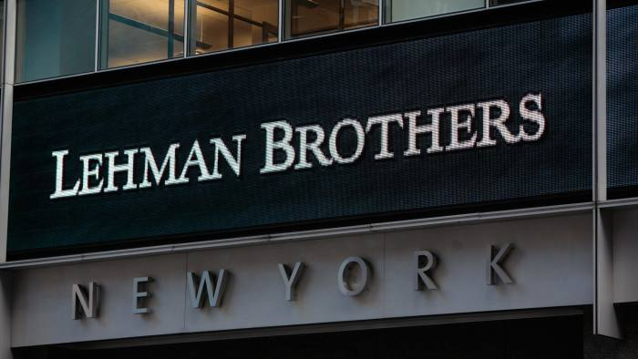

```{r setup, include=FALSE}
knitr::opts_chunk$set(echo = TRUE)
```

## 本课程的网络主页

<https://qiufei.github.io/banking/>


这里有课程PPT，课程讨论区等内容。

## 破产为什么叫bankruptcy ##

* bank 源自意大利语banca，意思是长凳。

* 当时的银行家每人在市场上有一个长凳（banca），以此作为他们经营的场所，所以他们被称之为banca。


## banca被砸，演变为今天的破产

* 当银行家偿付债务时，债主愤怒之下会砸了（rupt）他们吃饭的家伙。所以银行破产称之为bankruptcy。

* 后来所有经营失败的情况，都被称之为bankrupcy。


## 商业银行是经营信用的机构 ##

* 银行的不完全准备净制度，意味着，如果客户同时要求兑现存款的话，任何一家银行都会倒闭。

* 所以，银行的信誉，即向外界表明它的经营没有问题，是银行生存的前提。

* 在1929年以前，各家银行主要是靠自身实力来保证自己的信用，从而避免客户挤兑。

* 29年的大萧条之后，人们意识到金融系统的外部性太大，从而在美国建立了第一个现代的存款保险制度。

## 联邦存款保险公司（FDIC）与金融危机


* 联邦存款保险公司诞生于1933年，是吸取1929年金融危机的教训尔建立的

* 然而，到2009年，不在联邦存款保险公司保险范围内的雷曼公司因为信用破产，而引发了一场次贷金融危机。

## 信用破产与雷曼公司的倒闭



* 雷曼倒闭，根本原因当然还是其杠杆率过高
* 但破产的直接原因，是投资者大量赎回结构性投资产品。
* 然而雷曼不是商业银行，没有中央银行的信用支持，所以自身信誉丧失就意味着破产。


## 信用与风险是一对孪生兄弟 ##

* 既然信用风险会导致破产

* 那么为什么金融机构为什么不消除风险呢？

* 这是因为，金融机构的只能决定了风险是内生在其功能当中的。

* 比如，期限转换是其核心功能之一，然而期限转换的反面也就是期限错配。


## 商业银行的作用 ##

1. 信用中介。

2. 支付中介。

3. 信用创造。

4. 金融服务。

## 信用中介

1. 通过商业银行的负债业务，把社会上的各种闲散资金集中到银行

2. 再通过商业银行的资产业务，把它投向社会经济各部门

3. 促进投资，从而推动经济增长

## 支付中介

* 通过存款在帐户上的转移，代理客户支付；在存款的基础上，为客户兑付现款等，成为工商业团体和个人的货币保管者、出纳者和支付代理人 
   
* 支付中介职能的发挥，大大减少了现金的使用，节约了社会流通费用，加速了结算过程和货币资金周转，促进了经济发展 

## 信用创造
    
* 商业银行的信用创造职能是在信用中介与支付中介的职能基础之上产生的
  
* 不完全存款准备金制度使得银行体系可以创造派生贷款

## 金融服务

* 金融“百货公司”：商业银行根据客户的要求不断拓展自己的金融服务领域，如信托、租赁、咨询、经纪人业务及国际业务等，并在商业银行经营中占据越来越重要的地位。

* 金融基础设施：financial literacy，普惠金融


## 银行的组织类型 ##

1. 单一制银行

2. 分支行式银行

3. 银行控股公司

4. 金融控股公司

## 单一制银行 ##

* 传统banca的继承者。在美国较为多见，因为美国联邦制下，各州都反对金融权利集中。

* 优点：有利于自由竞争；有利于银行和地方政府的协调；独立性和自主性，经营灵活；管理层次少，有利于中央银行的监管

* 缺点：与现代经济横向发展的趋势不协调；业务集中于某一地区或者某一行业，不利于分散风险；不易取得规模经济效益

## 分支行式银行 ##

* 目前大部分国家，包括中国，都是实行这种银行体制。

* 优点：业务分散，有利于保障银行的安全性；易于取得规模经济效益；银行总数较少，便于宏观经济管理

* 缺点：容易形成垄断，降低经济效率；内部层次复杂，管理困难

## 银行控股公司 ##

* bank holding company: 是持有至少一家银行的股份而获得特许经营的公司。通常也兼营其他业务。

> 《银行控股公司法》：一家控股公司持有至少一家银行25%以上的股份，或者能指派至少一家银行两名以上的董事，就认为该控股公司对该银行存在控制行为。这种控制行为必须得到美联储（fed）的特许。

* 这是美国金融机构为了规避各州对银行跨州经营的限制而建立的组织结构。

## 金融控股公司 ##

* financial holding company：
控制公司是金融机构，且其他业务也是金融业务的银行控股公司。

* 目前，我国对金融控股公司的管理还存在法律的缺失。


## 我国的金融控股公司 ##

* 全牌照集团。

* 获取分业监管，准入限制下的垄断利润。

## 我国的金融控股集团举例  


## 银行组织结构演进的方向：混业、全功能 ##

银行向混业全功能机构转变，除了给消费者提供便利金融服务的考虑外，还有以下经营上的原因：

1. 便利的从资本市场筹集到资金。因为商业银行有中央银行的支持。

2. 通过集团内关联交易获得谁税收上的好处。

3. 规避分业监管的限制。


## 商业银行的经营原则 ##

* 金融机构的核心功能是管理风险 

* 核心竞争力 **有效控制风险。**

> 一个笑话：银行是一个只要你能证明你不需要钱，才能从哪里借到钱的地方。

