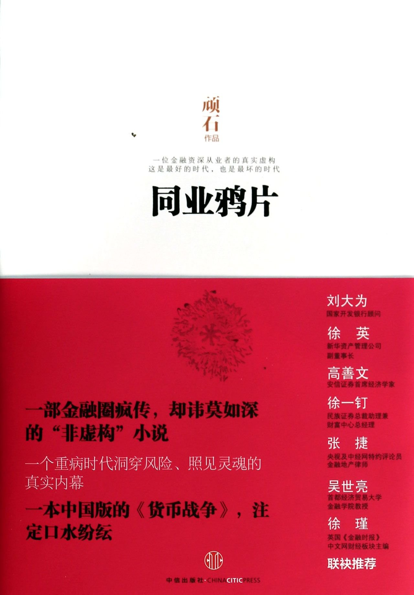

```{r setup, include = FALSE}
knitr::opts_chunk$set(echo = FALSE)
library(Quandl)
library(ggplot2)
library(ggthemes)
```

## 什么是金融“脱媒” ##

> “金融行业也需要搅局者……进来进行变革。”


## 金融脱媒的发展使得商业银行重视负债管理 ##

1. 负债来源就是资金来源。

2. 充足和稳定的资金来源是是保证商业银行生存和发展的关键。

3. 20世纪70年代后，金融创新不断出现，金融竞争日益加剧，商业银行存款不断减少。


## 商业银行资金来源：存款 ##

* 存款历来是维持商业银行经营的核心。

* 能最广泛的吸收公众资金的金融机构就是商业银行。这是它相对其他金融机构的资金来源优势。

## 中国活期存款 ##

quandl图

## 中国定期存款 ##

quandl图


## 存款的定价：成本加利润法 ##

$$ 单位存款的价格＝单位存款的经营支出＋分配单位存款的支出＋单位存款的计划利润 $$


## 存款的定价：边际成本法 ##

$$ 边际成本＝新利率×以新利率筹集的总资金—旧利率×以旧利率筹集的总资金$$

$$ 边际成本率＝ 边际成本/筹集的新增资金额 $$


## 商业银行资金来源：非存款 ##

* 同业拆借，

* 央行借款，

* 证券回购，

* 国际金融市场融资，

* 发行债券。


## 同业拆借 ##

* 流动资金不足的银行，通过银行间市场，向流动性富余的银行借钱。

* 我国同业拆借利率也已实现了市场化，基本体现了市场对资金的供求关系。

## “钱荒” 事件##

* 2013年6月份，中国银行间市场利率大幅上升。6月20日隔夜回购定盘利率达到接近13%的历史峰值。

* 这一事件被市场称之为钱荒。

##  ##



## 央行借款 ##

* 主要是以票据贴现的形式向中央银行贷款。

* 票据贴现利率由中央银行制定，这一利率变动反应中央银行政策的变动：

    1.  若贴现率提高，表明央行在收紧货币政策。
    2.  若贴现率降低，说明央行在实行宽松的货币政策

## 全国银行间同业隔夜拆借利率走势图 ##

```{r interbank, echo=FALSE}

# overnight Weighted Average Interest Rate(%)
interbank = Quandl("PBCHINA/REP_12.2", api_key="9iGeZZoG6Vc46rfs1AgJ")
ggplot(interbank,aes(x = Date, y = interbank[,2]))+
  geom_line()+
  ylab("overnight Weighted Average Interest Rate(%)")+
  theme_economist()

```

## 证券回购 ##

* 同业拆借是通过专门的系统向其他银行借钱，
* 央行借款是向中央银行借钱
* 证券回购是想金融市场的参与者借钱，以银行持有的证券为抵押品。

## 国际金融市场融资 ##

* 欧洲货币市场：当银行接受的存款货币不是母国货币时，该存款就成为欧洲货币存款。

* 起源于欧洲美元市场。


## 伦敦银行间同业拆借利率 ##

国际金融市场融资一般参考伦敦银行间同业拆借利率（libor）

     London Interbank Offered Rate

## libor走势图 ##


## Libor操纵丑闻 ##

《the economist》对该事件的评论：

> The rotten heart of finance


## 银行发行债券融资 ##
* 西方国家比较鼓励商业银行发行债券融资，

* 我国对此限制比较严。

## 我国商业银行的存款结构 ##

中资全国性大型银行人民币信贷收支表

```{r deposits, message=FALSE,warning=FALSE}

# 分别为总存款、活期个人存款，定期个人存款，活期单位存款，定期单位存款
deposit = Quandl(c("PBCHINA/REP_03B.1","PBCHINA/REP_03B.4","PBCHINA/REP_03B.5","PBCHINA/REP_03B.8","PBCHINA/REP_03B.9"), api_key="9iGeZZoG6Vc46rfs1AgJ")

colnames(deposit) = c("date","total","personal_demand","personal_time","institution_demand","institution_time")
library(dplyr)

deposit_ratio = transmute(deposit,
                          date = date,
                          p_demand = personal_demand/total,
                          p_time = personal_time/total,
                          i_demand = institution_demand/total,
                          i_time = institution_time/total)
library(reshape2)
deposit_graph = melt(deposit_ratio,id = "date")

ggplot(deposit_graph,aes(x = date, y = value, color = variable,group = variable))+
  geom_line()+
  theme_economist()

```

## 我国商业银行的负债结构 ##

大型全国行商业银行

```{r structure, message=FALSE,warning=FALSE}

# 分别为总存款、金融债券，卖出回购资产，央行借款，银行同业往来，其他和资金来源总计
jiegou = Quandl(c("PBCHINA/REP_03B.1","PBCHINA/REP_03B.15","PBCHINA/REP_03B.16","PBCHINA/REP_03B.17","PBCHINA/REP_03B.18","PBCHINA/REP_03B.19","PBCHINA/REP_03B.20"), api_key="9iGeZZoG6Vc46rfs1AgJ")

colnames(jiegou) = c("date","deposit","bond","repo","borrow","inter","other","total")

library(dplyr)

jiegou_ratio = transmute(jiegou,
                          date = date,
                          deposit_r = deposit/total,
                          bond_r = bond/total,
                         repo_r = repo/total,
                          borrow_r = borrow/total,
                          inter_r = inter/total,
                          other_r = other/total)
library(reshape2)
jiegou_graph = melt(jiegou_ratio,id = "date")

ggplot(jiegou_graph,aes(x = date, y = value, color = variable,group = variable))+
  geom_line()+
  theme_economist()

```

## 我国商业银行负债结构特点 ##

1. 各项存款是支撑商业银行资产运作的极为重要的来源，虽然2016年已经降低到接近75%。

2. 过度依赖存款也意味着资金来源风险大。虽然居民习惯和技术的进步，存款流失将给商业银行带来越来越大的冲击。


