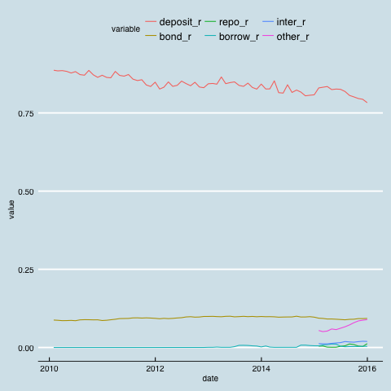

```{r setup, include = FALSE}
knitr::opts_chunk$set(echo = FALSE)
```

## 什么是金融“脱媒” ##

> “金融行业也需要搅局者……进来进行变革。”


## 金融脱媒的发展使得商业银行重视负债管理 ##

1. 负债来源就是资金来源。

2. 充足和稳定的资金来源是是保证商业银行生存和发展的关键。

3. 20世纪70年代后，金融创新不断出现，金融竞争日益加剧，商业银行存款不断减少。

## 商业银行负债的目的

主要有两个：

1. 维持银行资产的增长率

2. 保持银行的流动性


## 银行负债的构成

1. 计息负债
      * 存款负债:立身之本
      * 借款负债
2. 非计息负债
      * 结算性负债
      * 应付款项


## 商业银行最重要的资金来源：存款 ##

* 存款历来是维持商业银行经营的核心。

* 能最广泛的吸收公众资金的金融机构就是商业银行。这是它相对其他金融机构的资金来源优势。


## 存款的特殊性：大众角度

* 保本付息：风险低

* 随时支取：流动性高

* 支付基础：银行卡、支票

* 期限预定：活期、定期

* 对象不定：社会公众

* 特许经营：必须经监管机构特许

## 存款的特殊性：银行角度

* 存款是银行的象征

* 存款是银行重要性的主要原因

* 存款是银行脆弱性的重要来源

* 存款是银行正常经营的重要基础

## 中国存款的种类

1. 单位存款
    * 结算存款（活期存款）
    * 定期存款
    * 协定存款
    * 通知存款
    * 保证金存款
    * 大额可转让定期存单

2. 个人存款
    * 结算存款（活期存款）
    * 储蓄存款
    * 通知存款
    * 大额可转让定期存单

3. 同业存放 

## 结算存款（活期存款）

* 存款人可以随时用于转账结算，无固定期限，按活期存款利率支付利息

* 单位结算存款的四种账户：基本存款账户，一般存款账户，临时存款账户，专用存款账户

* 个人结算存款的三种账户：I，II，III三类账户

## 个人结算存款的三种账户


1. I类账户：全功能账户，同一个人在同一家行只能开一个I类账户

2. Ⅱ类户可以办理存款、购买投资理财产品等金融产品、限额消费和缴费、限额向非绑定账户转出资金业务。

3. Ⅲ类户可以办理限额消费和缴费、限额向非绑定账户转出资金业务。

网络解说版：I类是金库，II类是钱包，III累是零钱包。

##  单位协定存款

* 单位结算和定期存款的组合

* 客户按照与银行约定的存款额度开立的结算账户，账户中超过存款额度的部分，银行将其转入单位协定账户，并以优惠利率计息。


## 通知存款

* 存款人在存入款项时不约定存期，支取时需提前通知金融机构，约定支取存款日期和金额方能支取。

* 个人和单位均可办理：
   1. 一天通知存款
   2. 七天通知存款

## 保证金存款

* 银行为保证客户在银行为客户对外出具具有结算功能的信用工具，或提供资金融通后按约履行相关义务，而与其约定将一定数量的资金存入特定账户所形成的存款。单位与个人均可办理
* 在客户违约后，商业银行有权直接扣划该账户中的存款，以最大限度地减少银行损失。
* 保证金存款的种类：
    1. 银行承兑汇票保证金
    2. 信用证保证金
    3. 黄金交易保证金
    4. 个人购汇保证金
    5. 远期结售汇保证金


## 大额存单

* 以人民币计价的记账式大额存款凭证，是银行存款类金融产品，属一般性存款。

* 大额存单采用标准期限的产品形式。大额存单发行采用电子化的方式。

* 个人投资人认购大额存单起点金额不低于30万元，机构投资人认购大额存单起点金额不低于1000万元。

* 大额存单期限包括1个月、3个月、6个月、9个月、1年、18个月、2年、3年和5年共9个品种。

* 每期大额存单发行前在发行条款中明确是否允许转让、提前支取和赎回，以及相应的计息规则等。

## 存款的定价：成本加利润法 ##

单位存款的价格＝单位存款的经营支出＋分配单位存款的支出＋单位存款的计划利润


## 存款的定价：边际成本法 ##

边际成本＝新利率×以新利率筹集的总资金 —旧利率×以旧利率筹集的总资金

边际成本率＝ 边际成本/筹集的新增资金额 


## 商业银行资金来源：非存款 ##

* 同业拆借，

* 央行借款，

* 证券回购，

* 国际金融市场融资，

* 发行债券。

## 同业拆借 ##

* 流动资金不足的银行，通过银行间市场，向流动性富余的银行借钱。

* 我国同业拆借利率也已实现了市场化，基本体现了市场对资金的供求关系。

## “钱荒” 事件##

* 2013年6月份，中国银行间市场利率大幅上升。6月20日隔夜回购定盘利率达到接近13%的历史峰值。

* 这一事件被市场称之为钱荒。

##  ##


## 央行借款 ##

* 主要是以票据贴现的形式向中央银行贷款。

* 票据贴现利率由中央银行制定，这一利率变动反应中央银行政策的变动：

    1.  若贴现率提高，表明央行在收紧货币政策。
    2.  若贴现率降低，说明央行在实行宽松的货币政策

## 全国银行间同业隔夜拆借利率走势图 ##


## 证券回购 ##

* 同业拆借是通过专门的系统向其他银行借钱，

* 央行借款是向中央银行借钱

* 证券回购是想金融市场的参与者借钱，以银行持有的证券为抵押品。

## 证券回购的两种方式

1. 质押式回购（权利质押）
      * 资金融入方（正回购方）在将债券**出质**给资金融出方（逆回购方）融入资金的同时，
      * 双方约定在将来某一日期由正回购方按约定回购利率计算的资金额向逆回购方返还资金，逆回购方向正回购方返还原出质债券。

2. 买断式回购
      * 债券持有人（正回购方）将债券卖给债券购买方（逆回购方）的同时，
      * 交易双方约定在未来某一时期，正回购方再以约定价格从逆回购方买回相等数量同种债券的交易行为。


## 国际金融市场融资 ##

* 欧洲货币市场：当银行接受的存款货币不是母国货币时，该存款就成为欧洲货币存款。

* 起源于欧洲美元市场。


## 伦敦银行间同业拆借利率 ##

* 国际金融市场融资一般参考伦敦银行间同业拆借利率（libor, London Interbank Offered Rate)

* Libor操纵丑闻

> The rotten heart of finance


## 银行发行债券融资 ##

* 西方国家比较鼓励商业银行发行债券融资，

* 我国对此限制比较严。


## 普通金融债券

* 商业银行在金融市场上发行的、按约定还本付息的有价证券。

* 优势
  1. 相对存款利用率高，因为不用缴纳存款准备金。
  2. 稳定，因为期限长。
  3. 广告宣传效应，一般有实力的机构才被允许发债。
  4. 促进管理，信息披露。

## 次级债券

* 本金和利息的清偿顺序列于商业银行其他负债之后、先于商业银行股权资本。

* 可计入银行附属资本，能提高资本充足率

## 混合资本债券

* 当发行人清算时，混合资本债券本金和利息的清偿顺序列于一般债务和次级债务之后、先于股权资本。

* 期限一般比次级债券还长。

* 可按一定标准计入银行附属资本


## 我国商业银行的存款结构 ##
中资全国性大型银行人民币信贷收支表


## 我国商业银行的负债结构 ##

大型全国行商业银行




## 我国商业银行负债结构特点 ##

1. 各项存款是支撑商业银行资产运作的极为重要的来源，虽然2016年已经降低到接近75%。

2. 过度依赖存款也意味着资金来源风险大。虽然居民习惯和技术的进步，存款流失将给商业银行带来越来越大的冲击。


