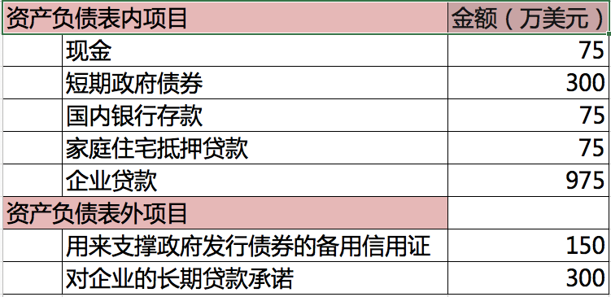
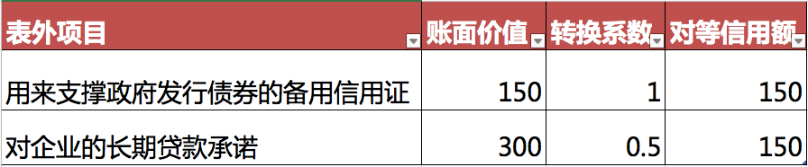
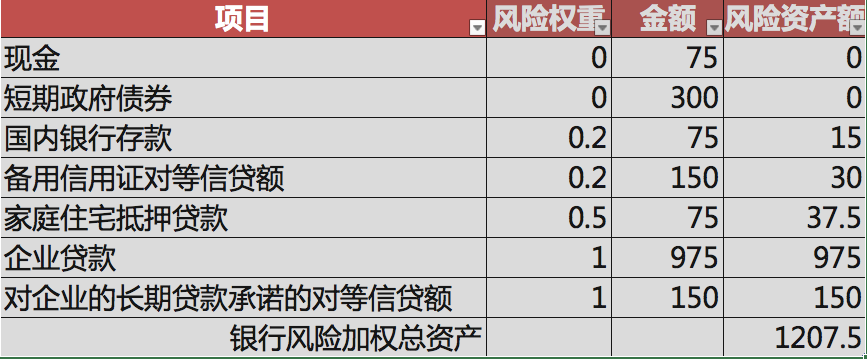

## 银行资本的一则新闻
* FT报道，美国18家大银行持有1200亿美元的超额资本。

* Citigroup最多，291亿；Bank of America有212亿；JPMorgan Chase有197亿。

## 银行的资本是在监管部门的要求下才提高的

* 在美联储的要求下，美国的银行才开始提高资本水平。

* 从2009年至今，美国大银行已经增加了7000亿美元的风险吸收资本（loss-absorbing equity ）。

## 商业银行资本的性质 ##

* 银行资本为何重要？监管机构为何这么重视资本？

* 因为商业银行资本（净值）是银行抵偿风险的最后一道防线。

## 银行资本是银行稳健经营的基础

资本的关键作用：吸收意外损失，消除银行的不稳定因素 

1. 缓冲器：吸收经营亏损，保证正常经营
2. 银行正常经营之前的启动资金
3. 显示银行实力，维持市场信心
4. 为银行扩张和业务拓展提供资金
5. 适应监管当局的需要，保证银行的持续增长

## 商业银行是经营风险的机构 ##

* 金融机构的核心竞争力是管理风险的能力。

* 商业银行面临以下风险：

1. 信用风险：别人不支付给我 

2. 流动性风险：我无力支付给别人

3. 利率风险

4. 汇率风险

5. 操作风险

> 保持一定规模的银行资本是规避风险的策略之一

## 资本是重要的监管指标 ##

* 为了控制风险，监管部门和市场都要求

* 银行的**风险资产（如贷款）**

* 与银行的**资本**保持一定的比例。

## 银行资本的构成 

* 银行资本的一般来源：
    
    1. 商业银行创立时所筹措的资本
    2. 商业银行的留存利润

* 具体形式：实收资本、资本公积、盈余公积、未分配利润、重估储备、权益准备金、次级债务（Subordinated debt）

## 风险管理与资本监管挂钩的历程 ##

* 20世纪80年代以前，金融监管部门的要求是资本与银行总资产相联系。

* 20世纪80年代后期，各国金融监管部门逐渐把银行的最低资本额与银行的资产质量联系起来。

* 1988年，国际清算银行（bank of internatio settlement，BIS）通过了《关于统一国际银行资本和资本标准的协议》（即《巴塞尔协议I》）。

* 协议规定：商业银行的资本应与资产的风险相联系。**银行资本的主要作用就是吸收和消化银行损失，是银行免于倒闭危机。**

## 巴塞尔协议的主要思想 ##

* 商业银行的最低资本由银行资产结构形成的资产风险所决定，资产风险越大，最低资本额越高；

* 银行的主要资本是银行持股人的股本，构成银行的核心资本；

* 协议签署国银行的最低资本限额为银行风险资产的8%，核心资本不能低于风险资产的4%；

* 国际间的银行业竞争应使银行资本金达到相似的水平。 

## 巴塞尔协议对银行资本的分类 ##

根据《巴塞尔协议I》，银行资本分类两类：

1. 一级资本（核心资本）：股本，公开储备（资本公积、未分配利润等）。

2. 二级资本（附属资本）：各种准备金，混合资本工具（具有债务和股权双重性质的资本工具），长期附属债务。

## 协议对资本扣除的规定 ##

1. 商誉。原因：商誉是一种无形资产，其价值大小难以确定。

2. 对从事银行业务和金融活动的附属机构的投资。原因：
       * 避免银行体系相互交叉控股，导致同一资本来源在一个集团中重复计算的“双重杠杆效应”；
       * 避免跨国银行利用自己的全球网络巧妙调拨资金，规避管制或进行投机活动。

## 我国对商业银行资本的规定
《商业银行资本管理办法》(2012)

1. 核心一级资本： 实收资本或普通股； 资本公积； 盈余公积；一般风险准备； 未分配利润； 少数股东资本可计入部分；其他一级资本。

2. 二级资本：二级资本工具及溢价；超额贷款损失准备；少数股东资本可计入部分。

* 什么是**少数股东资本可计入部分**：商业银行附属公司适用于资本充足率监管的，附属公司直接发行且由第三方持有的少数股东资本可以部分计入监管资本。

## 《巴塞尔协议I》对银行资本的要求 ##

1. 核心资本（一级资本）对风险资产的比例不低于4%

2. 总资本（一级资本加二级资本）对风险资产的比例不低于8%

## 风险资产的计算 ##

* 风险资产全称是“总加权风险资产”，就是银行的各项资产通过乘以其各自的转换系数后再加总得到的资产总额。

* 一项资产风险越大，其转换系数越大。

* 一项资产风险越小，其转换系数越小，最小为0。

## 风险资产计算的例子 ##
原始数据

## 风险资产计算：转换率
表外转化为表内

## 风险资产总额

## 《巴塞尔协议II》对资本要求的改进 ##

1. 加入
**市场风险资本要求**
与
**操作风险资本要求**

2. 核心一级资本（股本）对风险资产的比例不低于4.5%

3. 一级资本对风险资产的比例不低于6%。

4. 总资本（一级资本加二级资本）对风险资产的比例不低于8%。

## 《巴塞尔协议III》 对资本要求的改进 ##

* 次贷危机后，很多银行因为没有考虑表外资产的风险而破产，为此巴塞尔委员会加入了非风险杠杆率要求：

* 该指标要求不低于3%。

$$ 非风险杠杆率 = \frac{一级资本}{资产 + 表外风险暴露} $$ 

