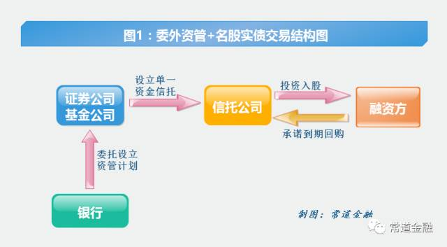

## 为什么不全部放贷款？ ##
商业银行一般不会把所有资金都用在贷款上，这是因为：

1. 贷款流动性低，如果银行急需现金，难以套现。

2. 贷款的违约率较高，因此在规模上要有控制。

3. 对于集中于一地的中小银行而言，当地可能没有足够的贷款机会。

## 银行证券投资的功能 ##

1. 获取收益：没有合适贷款机会时，不使资金闲置。

2. 管理风险：通过证券投资分散资产分布。

3. 增强流动性：持有的短期投资作为二级储备。

4. 管理风险资本：银行持有的证券等级一般较高，其风险系数较小，对资本占用少。

5. 合理避税：我国国债利息收入不征税，且可弥补银行以前年度的亏损。

## 商业银行投资的证券种类 ##

1. 政府债券

2. 公司债券

3. 股票

4. 商业票据

5. 回购协议

6. 中央银行票据

7. 金融衍生品

## 商业银行投资于股票的限制 ##

* 大多数国家法律都禁止商业银行投资于工商业股票

* 德国、奥地利和瑞士等少数国家例外。

## 我国商业银行投资范围的限制 ##

《中华人民共和国商业银行法》规定，商业银行在境内：

* 不得从事信托投资和股票业务

* 不得投资于非自用不动产

* 不得向非银行金融机构和企业投资

## 我国商业银行证券投资的范围 ##

1. 国库券、国家建设债券、国家投资债券、国家特种债券

2. 金融债券

3. 企业债券

4. 央行票据

5. 回购协议

6. 银行承兑票据

7. 衍生品：这个有进入门槛

## 商业银行证券风险的测度：标准差法

$$ \sigma_i = \sqrt{\sum_{i=1}^{n}(R_it-R)^2 \times P_i} $$

$$ R = \sum_{i=1}^{n}R_i \times P_i $$

* 其中 $\sigma_i$是证券组合中第i种证券的风险度，$R_it$为第i种证券在各期的预期收益率，$P_i$为$R_it$发生的概率，$R$为证券组合的预期收益率。

* 标准差反映了不同证券风险的大小，既包括系统风险，也包括非系统风险。标准差越大，风险越大；标准差越小，风险越小。

## 商业银行证券风险的测度：$\beta$系数法

$$ \beta = \frac{某证券预期收益-该预期收益中非风险部分}{整个证券组合的预期收益-该预期收益中非风险的部分} $$

* $\beta$系数法主要是衡量证券的系统性风险，它衡量的是某种证券相对于整个证券市场收益水平的收益变化情况。

* 证券的$\beta$值大于1，则表明该证券收益的波动幅度要比证券市场的收益波动幅度大，因而风险也较大。如果$\beta$值小于1，则表明该证券收益的波动幅度比证券市场收益的波动幅度要小，因而风险也较小。 

## 商业银行证券投资的主要策略 ##

1. 分散化投资法

2. 期限分离法

3. 灵活调整法

4. 证券调换法

## 分散化投资法 ##

* 期限分散法、地域分散法、类型分散法、发行分散法

* 最重要的是期限分散法。为什么？

## 等额期限分散法 ##

商业银行证券投资在期限分散上的主要办法是等额期限法：

1. 将全部投资资金平均投入到各种期限的证券上

2. 当期限最短的证券到期回收资金后，买入当下期限最长的证券

3. 如此循环往复，保持各期限证券数量的相等

## 期限分离法 ##
* 分散投资法是不知道风险分布的情况下，最简单的将鸡蛋平均放到不同篮子中的战略。

* 期限分离法则是根据自己对风险的预测，将鸡蛋集中放到某些篮子中。

## 期限分离法的几种操作战略 ##

1. 短期投资战略：银行预测短期利率趋于下跌，将绝大部分资金放到短期证券上。

2. 长期投资战略：银行预测其流动性需求较低，将绝大部门资金投资到长期证券上。

3. 杠铃投资战略：银行根据其对利率和流动性的预测，将资金在短期和长期证券上分布，而几乎不持有中期证券。

## 灵活调整法 ##

* 是对杠铃投资战略的进一步灵活操作。

* 银行根据其对利率变化的预测，将全部资金投资到某一种证券上。

* 这是一种高风险的战略。

## 证券调换法 ##

这是一种套取无风险收益的战略：

1. 价格调换：债券其他特征一致，只在价格有差异，于是买低卖高。

2. 收益率调换：债券其他特征一致，只在票面收益率有差异，于是买高卖低。

3. 利率预期调换：预测利率变化会对证券收益产生影响，于是将受损证券换成获益证券。

4. 减税调换：为了规避累进制所得税，在证券投资收益达到一定限额时，出售价格下跌的证券以减少资本利得。

## 银行与证券业的分离与融合 ##

1. 20世纪之前：早期的自然分离

2. 20世纪初期：融合

3. 大萧条之后的分离

4. 20世纪70年代以来的融合

## 分业经营的优点 ##

1. 有利于提高专业化水平

2. 为业务发展提供了稳定而封闭的环境

3. 有利于保证商业银行及客户的安全，证券投资是高风险的活动。

4. 有利于抑制金融危机的产生。

## 分业经营的缺点 ##

1. 抑制了金融机构之间的竞争

2. 抑制了不同金融机构之间优势的互补

3. 分业经营的银行在与混业经营的银行的国际竞争中缺乏优势

## 混业经营的优点 ##

1. 可以拓展银行的业务空间，降低金融机构个体的风险。

2. 有利于金融机构竞争

3. 有利于银行全面掌握企业的情况

## 混业经营的缺点 ##

1. 容易形成大金融集团的垄断

2. 金融机构的经营效率会降低

3. 过大的金融机构会带来系统性金融风险

## 到底是用混业经营还是分业经营？ ##

* 金融是一个外部性很大的行业，因此必须要有政府的监管。

* 政府的监管能力决定了采用那种模式比较合适。

* 混业经营业务复杂，对监管能力的要求较高。

## 银行委外业务简介

- 委外业务，是“委托外部投资业务”的简称，指委托人将资金委托给外部机构管理人，由外部机构管理人按照委托协议约定进行投资管理的业务模式。

## 委外业务的起因

- 近年来城商行和农商行的理财、自营资金规模快速增长，而团队自身投资水平无法匹配，委托外部投资就成为一个重要的资产配置渠道。

- 其主要表现形式包括信托计划、基金公司、券商、保险资产管理计划、信托计划、保险计划。

- 委托人（银行）按照协议约定获得投资管理的收益，管理人（信托、券商、基金公司和保险公司）一般以“固定管理业绩+超额业绩分成”的方式收取管理费。

## 受监管关注的原因：嵌套和名股实债

- 资管嵌套，就是两个资管产品相互组合，一个产品套另一个产品，实现资管业务的跨金融机构、跨市场交叉。
 
- 两个层次的嵌套，一是银行理财与券商资管的嵌套，二是券商资管与信托计划的嵌套。嵌套的目的主要是通过“银行理财+券商资管+信托计划”绕道规避银监和证监的分业监管。

## 名股实债

- 是指名义上是股权投资，实际上是债权融资、发放贷款。
 
- 名义上的股权投资，就是以股权资金的形式进入融资方。

- 实际上的债权融资则是通过各种刚性兑付的保本约定实现。如：约定股权投资的固定投资期限和收益率，或者要求融资方在投资协议中签订回购或对赌条款等。

- 承诺刚性兑付或保本是名股实债区别于纯粹股权投资的主要特征，纯粹股权投资是浮动收益，不可能承诺刚性兑付或保本。
 
## 金融“创新”的动机：投资方

- 一方面可以规避自身不存在放贷资质的法律规定（如券商资管），

- 另一方面可以通过名义上的股权融资法律形式，规避债权融资的相关规定。

## 金融“创新”的动机：融资方

- 一方面可以增加获取融资的渠道

- 另一方面则可以在账面上扩大自己的股本金，降低财务杠杆。

## 金融“创新”的动机：通道方

信托公司、证券公司等在名股实债业务流程中充当了通道方，获取了通道费等业务收入。

## 风险点在那里？

- 在名股实债名义下，隐藏了企业真实的资产负债结构，降低了企业资产负债率，表面上有利于其后续各类融资活动，

- 实际上却从另外一方面增加了企业的财务杠杆，加大了违约的概率。
