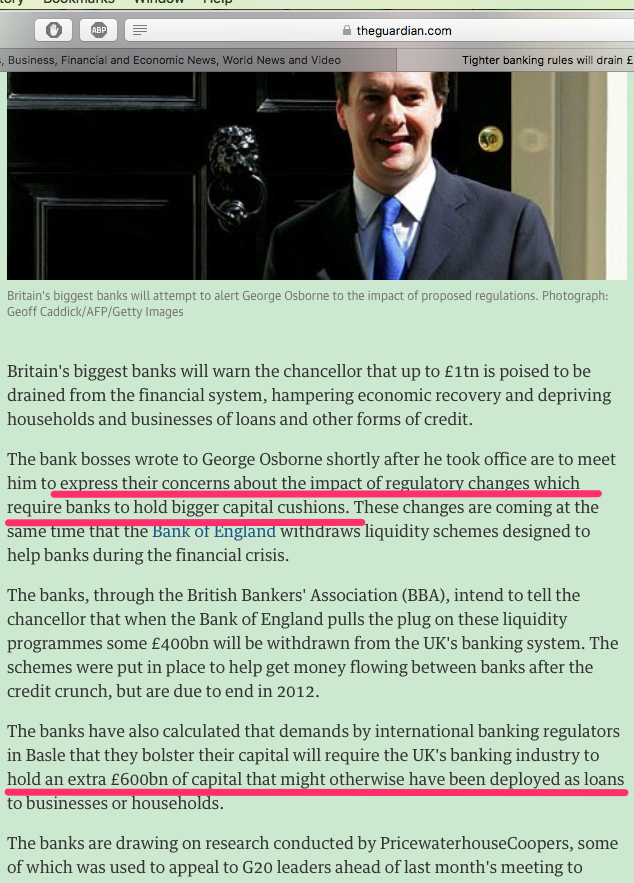
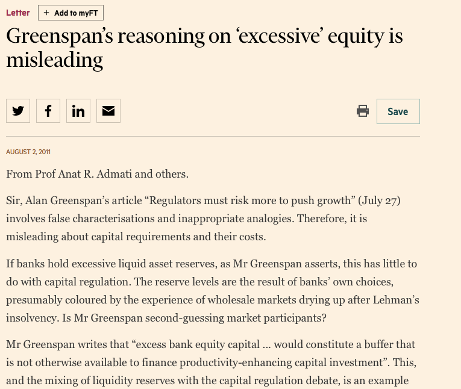
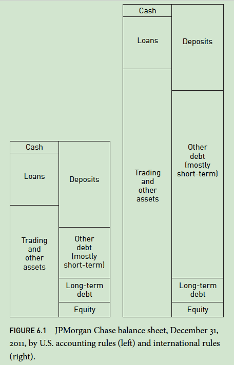
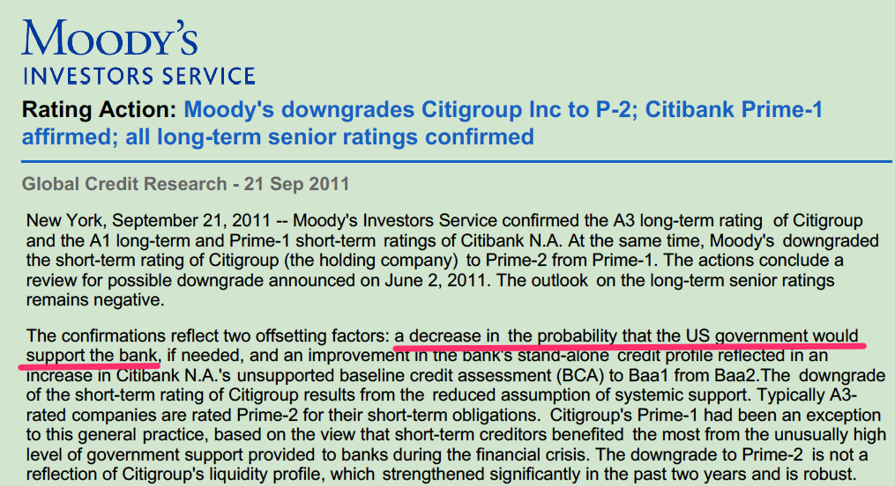

```{r setup, include=FALSE}
knitr::opts_chunk$set(echo = TRUE)
```

## the guardian的一则新闻：认为资本金水平提高会影响信贷能力



## 卫报中英国银行家的观点

1. concerns about the impact of regulatory changes which require banks to hold bigger capital cushions. （银行对提高资本金水平表示担忧）

2. hold an extra £600bn of capital that might otherwise have been deployed as loans.（担忧的原因是他们认为提高资本金水平会使得能放贷的资金减少） 

## 格林斯潘的观点

> “excess bank equity capital ... would constitute a buffer that is not otherwise available to finance productivity-enhancing capital investment”. 


## 教授的愤怒



## 教授联名信的观点

- 格林斯潘混淆了资本金和准备金

- 在19世纪，银行的资本金水平一般时40%。

- 银行在当贷款时，一般要求借款人的资本金要在25%以上。


## 资本金不是准备金，提高资本金水平不影响银行的资金使用

- 资本金（capital）是银行资金来源的一种，是股东投入的资金。

- 准备金是商业银行缴存中央银行的自己，这是对银行资金的占用。

- 资本金要求不等于准备金要求。

- 要求银行多使用资本金只是要求银行在运营中少依赖于借来的资金。


## 提高资金本的目的：控制杠杆率

- 资本金，也就是普通企业所言的股本金，提高资本金比重并没有限制你怎么用这笔资金。

- 杠杆率过高是银行的风险之源。

- 不通过负债融资，可以通过股东资金投入，并不会减少贷款资金。

- 股东投入的资金并不是不能拿出去放贷款。

## 新的借口：不负债就限制了银行的信贷能力

- 当提高资金金不会影响银行的资金使用说清楚了之后，他们又着新的理由来说明为什么要过度负债。

- 一个经典的说辞是，他们认为限制银行借钱会限制银行的信贷能力，从而给经济增长带来负面影响。

- 但是他们绝口不提银行负债水平过高造成的金融不稳定和金融危机对增长的负面影响。

## 高负债也不是为了实体信贷


## 会计准则下的把戏

- 在GAAP（美国会计准则）下，衍生品可以不计入资产负债表

- 在IFRS（欧洲会计准则）下，衍生品要计入资产负债表

- 在GAAP下摩根信贷资产占比为31%，在IFRS下，信贷资产占比只为17%。

## 高杠杆杀伤力的示意图

- 一家银行初始资产规模100亿，资本金为2亿。

- 如果资产价格缩水1%，那么工资资产价格变为99，负债金额不变，那么资本金减少1亿，变为1亿元。

- 如果不增加资本金，要达到之前的资本金水平，那么它职能持有50亿的资产，这就是说这家银行需要压缩近一般的资产。

- 这不仅对银行本身会造成重大影响，对金融市场也会造成冲击。

## 高资本金的好处

- 如果银行开始的资本金比例是20%，也就是说它有20亿低资本金

- 资产价格缩水1%，银行资本金只是减少1亿元后，还有19亿元。要达到之前的资金金水水平，它还还以维持95亿元的资产规模，也就是说它只需要出售4亿元资产，也就是只用压缩4%的资产。

- 4%相对于之前的50%，是一个小的多的幅度。


## 杠杆率过大的影响

- 杠杆率过高的话，当发生损失时，银行需要抛售大量的资产，遭受更大的资产价格压力

- 如果银行的初始的资本金水平较高的话，去杠杆的冲击就小的多。


## 资本金吸收风险的能力

- 非债务资金没有在某个时点必须支付资金的压力，

- 所以这种资金越多，商业银行吸收损失的能力就越大。


## 新的说辞

- 银行完全可以通过股权融资来给自己补充资金，于是，又有人说股权资金成本太高。

- 如果股权资金成本较高，那为什么其他行业不是这样的呢？为什们其他部门没有过度借债，从而节约股权资金呢？

- 好的公司，例如苹果公司，长期保持0负债。


## 银行是特殊的行业嘛？

- 银行是个特殊的行业吗？

- 然而投资者是用同样的估值模型来计算公司的股票。


## 银行负债的低成本是因为什么？

- 如果债权人知道，借款人出问题的话，有政府来救助，那么债权人就十分乐意借钱给这些借款人，利率也比较低，

- 于是，更这种低利率相比，银行的股权资金的成本就显得较高。

## 银行因为有了政府的隐性担保，才导致借款成本低

- 银行的借款资金因为有了纳税人的隐形担保，才会显得价格较低。

- 银行只考虑自己的成本，而不考虑他们给纳税人带来的成本。

- 银行当然会否认这种隐形担保，但实际上评级公司在评级时就考虑了这种隐性担保。

## 穆迪对花旗银行银行的评级




## 又一个新的说辞：关于国际竞争力的借口

- 如果竞争力是由于政府的隐性补贴得来的，那这种不是竞争力。

- 爱尔兰和西班牙的政府就是因为救助其规模巨大的银行系统而陷入了财政危机，需要IMF的贷款帮助。

- Dodd-Frank 就是为了解决银行大而不能倒的问题，但是对于全球系统性重要的银行而言，如果解决清算一家在全球各地都有分支机构的银行还有困难，应该各地法律不同意，所以损失如何分担不能统一意见。


## 把戏总结

- 混淆概念

- 认为银行是特殊的机构，以至于在经济和金融领域适用的规则在银行业不适用。

- 制造不存在的trade off

## 风险控制手段总结

- 控制银行的活动。如贷款的类型和金额

- 控制期限错配。

- 提高资本金。

## 资本金的作用

- 更多的资本金其实会扩展银行的自由空间，因为他有稳定的资金来源

- 资本金恢复到社会一般水平，也有利于纠正金融业的激励结构