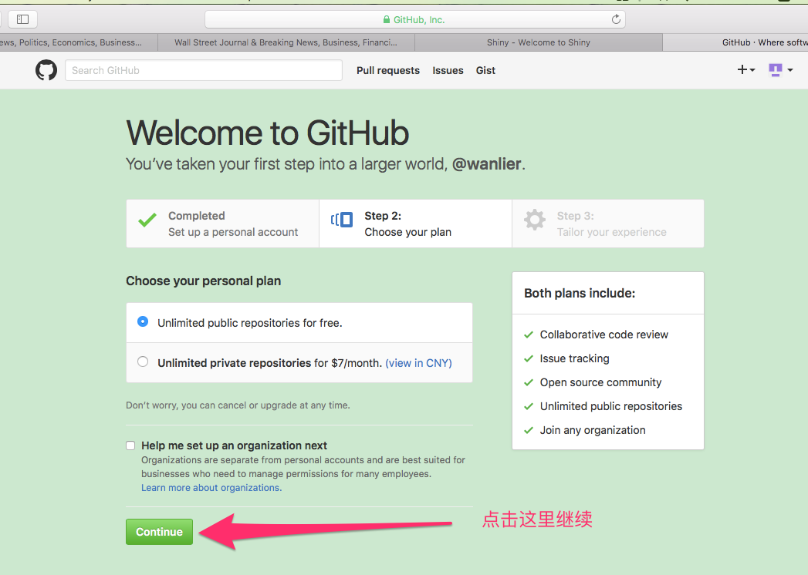
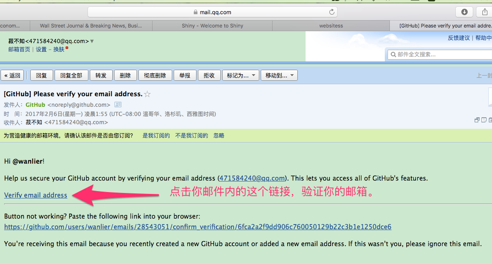
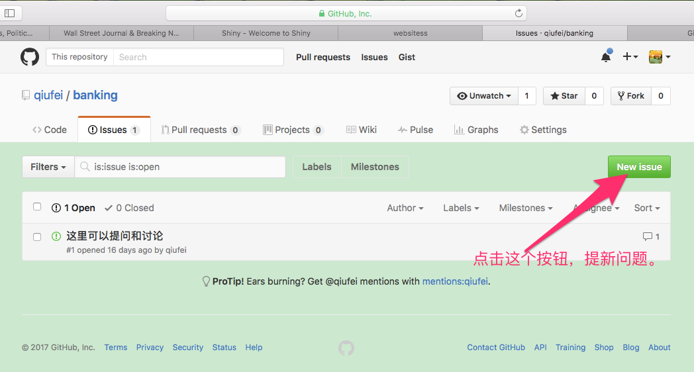
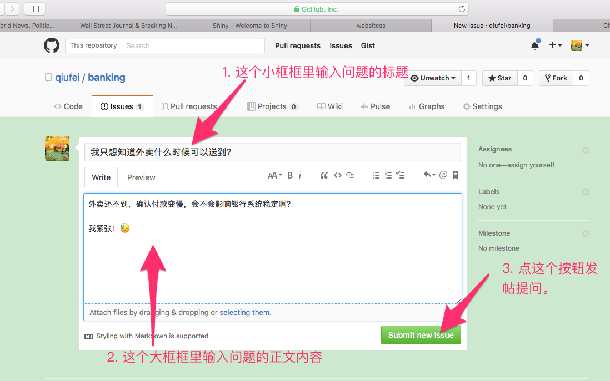
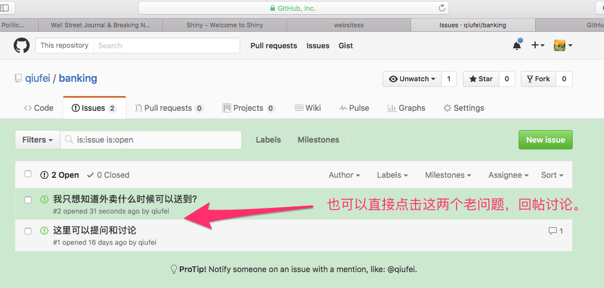

# 商业银行业务与经营

## 一、课程PPT

[第1章 导论](http://htmlpreview.github.com/?https://github.com/qiufei/banking/blob/master/PPT/第一章导论.html)

[第2章 商业银行的资本管理](http://htmlpreview.github.com/?https://github.com/qiufei/banking/blob/master/PPT/第二章资本管理.html)

[第3章 商业银行的负债及其管理](http://htmlpreview.github.com/?https://github.com/qiufei/banking/blob/master/PPT/第三章负债管理.html)

[第4章 商业银行流动性管理](http://htmlpreview.github.com/?https://github.com/qiufei/banking/blob/master/PPT/第四章现金资产管理.html)

[第5章 商业银行贷款业务管理——贷款政策和程序](http://htmlpreview.github.com/?https://github.com/qiufei/banking/blob/master/PPT/第五章贷款政策与管理.html)

[第6章 企业贷款及其管理](http://htmlpreview.github.com/?https://github.com/qiufei/banking/blob/master/PPT/第六章企业贷款.html)

[第7章个人贷款](http://htmlpreview.github.com/?https://github.com/qiufei/banking/blob/master/PPT/第七章个人贷款.html)

[第8章 商业银行的证券投资管理](http://htmlpreview.github.com/?https://github.com/qiufei/banking/blob/master/PPT/第八章商业银行证券投资管理.html)

[第9章 商业银行的中间业务管理](http://htmlpreview.github.com/?https://github.com/qiufei/banking/blob/master/PPT/第九章商业银行中间业务.html)

[第10章 商业银行风险管理](http://htmlpreview.github.com/?https://github.com/qiufei/banking/blob/master/PPT/第十章商业银行风险管理.html) [第10章 backup](https://rawgit.com/qiufei/banking/master/PPT/第十章商业银行风险管理.html)

[第11章 商业银行的财务分析与业绩评价](http://htmlpreview.github.com/?https://github.com/qiufei/banking/blob/master/PPT/第十一章商业银行的业绩评价.html)

* 如果因为网络或者服务器的愿意以上链接不能在线打开，可以[在这里下载html格式的源文件](https://github.com/qiufei/banking/tree/master/PPT)到本地，再用网络浏览器打开观看。

[第12章 电子银行](http://htmlpreview.github.io/?https://github.com/qiufei/banking/blob/master/PPT/第十二章电子银行.html)

[第13章 国际银行](http://htmlpreview.github.io/?https://github.com/qiufei/banking/blob/master/PPT/第十三章国际银行.html)

[第14章 中国银行业经营现状](http://htmlpreview.github.io/?https://github.com/qiufei/banking/blob/master/PPT/第十四章中国银行业经营现状.html) [备用地址](https://rawgit.com/qiufei/banking/master/PPT/第十四章中国银行业经营现状.html)

### 讨论PPT

[discussion 1](http://htmlpreview.github.io/?https://github.com/qiufei/banking/blob/master/PPT/讨论一：提高资本金水平是否会造成信贷crunch.html)

[discusiion 2](http://htmlpreview.github.io/?https://github.com/qiufei/banking/blob/master/PPT/讨论二：银行的混业与分业.html)

[discussion 3](http://htmlpreview.github.io/?https://github.com/qiufei/banking/blob/master/PPT/讨论三：政府对商业银行的担保之后应该要求什么.html)

[discussion 4](http://htmlpreview.github.io/?https://github.com/qiufei/banking/blob/master/PPT/讨论四：住房抵押贷款证券化是否应该由商业银行来做.html)

## 二、互动讨论区

关于课程的提问和讨论，可以到课程的互动讨论界面进行，网址如下：

<https://github.com/qiufei/banking/issues>

也欢迎对本课程和老师的授课进行批评吐槽，我看到会努力改进。

要在这里讨论提问或者吐槽的话，首先要有githud账户，然后在哪个讨论界面发帖。下面讲解如何做这两步。

### （一）吐槽先在github网站注册新账户

github网站网址<https://github.com>

> **建议大家用自己“姓名全拼+学号后四位”作为用户名，这样我可以根据大家的发言讨论情况，给平时成绩加分。**

比如,学号20169201314的韩梅梅同学，建议用户名为hanmeimei1314。

1.填写注册信息

2.完成账户注册

3.验证账户邮箱

### （二）创建Issues，自己提新的问题。

注册账户后，登陆你的github账户，然后打开这个网址<https://github.com/qiufei/banking/issues>。可以在此进行提问和讨论。方法如下：

1. 新建Issue

2.发帖提问

3.当然你也可以对已经存在的老issue，回帖进行讨论。 

## 参考书

1. 庄毓敏 《商业银行业务与经营》 中国人民大学出版社  2014年10月 第4版 

2. 周好文 何自云  《商业银行管理》    北京大学出版社   2014年9月 第2版

3. Rose P S, Hudgins S C. Bank management and financial services  McGraw-Hill Education 2012年2月 第9版 

